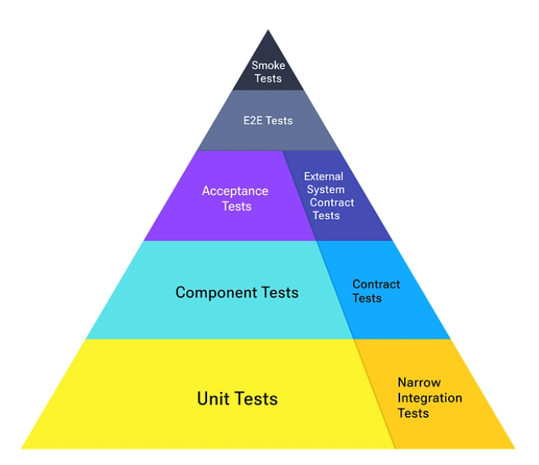

# Ticket Buddy
A simple ticket booking platform for events.

## Modular Monolith
Built in well-defined modules to be hosted as a single application. Modules communicate through asynchronous messages using MassTransit with RabbitMQ. 

You could also use synchronous network calls between modules if preferred though it will not scale as well.
In-process calls between modules are monolithic and not recommended.

Strictly speaking, the common libraries are slightly against the modular nature but they help reduce code duplication and improve consistency across modules.

A modular monolith is where a team should start when building a new application.

[Modular Monolith Architecture](./ModularMonolith/README.md)

## Testing
The testing approach is inspired by the [Modern Test Pyramid](https://dev.to/optivem/modern-test-pyramid-4dfc).

## Key technologies/choices:
- ASP.NET Core
- Docker
- RabbitMQ
- MassTransit
- OpenTelemetry
- .NET Aspire
- Redis Distributed Cache
- PostgreSQL
- CQRS using Entity Framework Core & Dapper
- React + Vite + Vitest

## Observability

Ticket Buddy uses OpenTelemetry to provide comprehensive observability across all services. 
The modular telemetry data is visualized in the Aspire dashboard.

