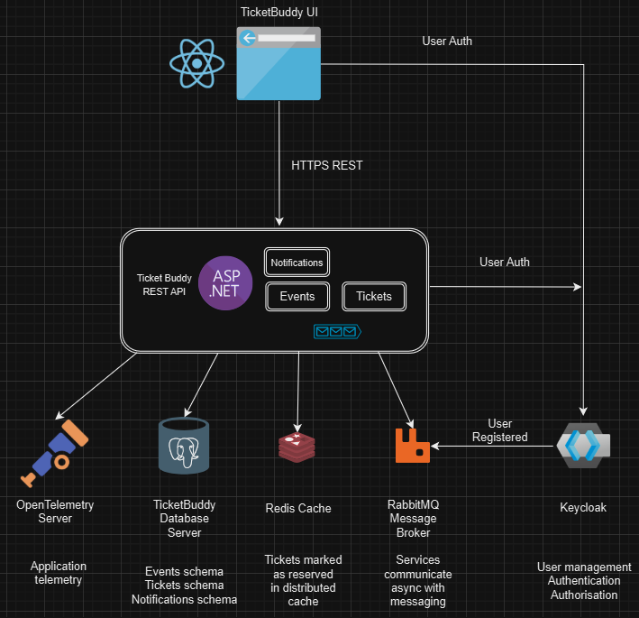
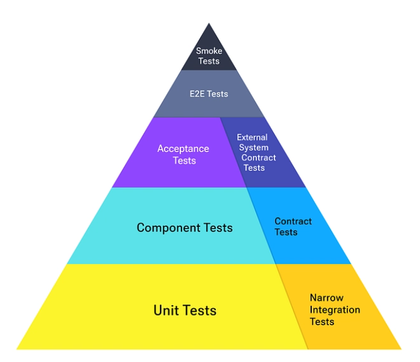
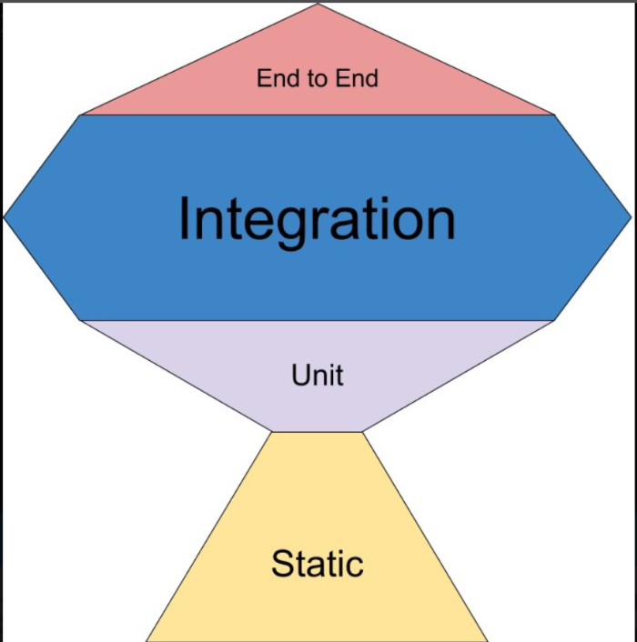
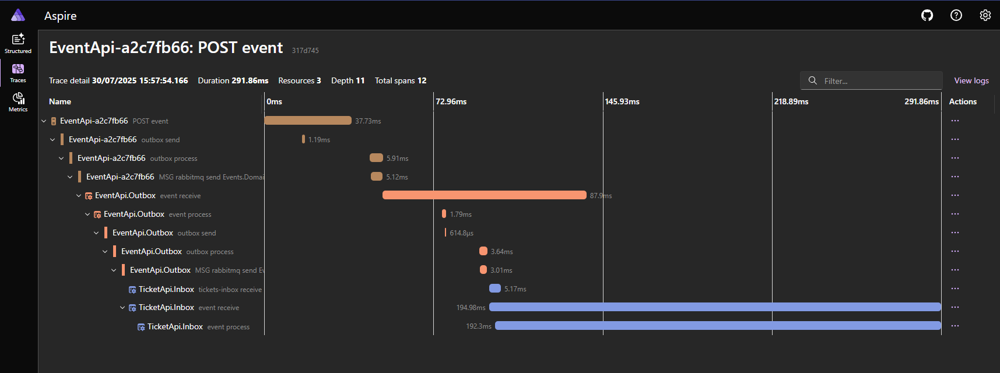

# TicketBuddy
A simple ticket booking platform for events.

## Pre-requisites
Run the setup.ps1 or setup.sh script as Administrator to install all dependencies:

This installs: .NET 10 SDK, Docker, Node.js, .NET Aspire workload, and configures the GitHub NuGet feed.

## Modular Monolith
Built in well-defined modules to be hosted as a single application. Modules communicate through asynchronous messages using MassTransit with RabbitMQ. 

You could also use synchronous network calls between modules if preferred though it will not scale as well.
In-process calls between modules are monolithic and not recommended.

The common libraries are slightly against the modular nature but they help reduce code duplication and improve consistency across modules.

A modular monolith is a good place for a team to start when building a new application.

## Running Locally
- A: Ensure docker is running and then run the LocalHost.Aspire project
- B: Ensure docker is running and then run docker compose and pass in your GitHub package feed token.
- C: Run your own dependencies and manually set appsettings.json files for each project. Then run migrations => API => dataseeder => UI with `npm run dev`
- D: Run on a local Kubernetes cluster using [kind](https://kind.sigs.k8s.io/). Requires `kubectl` and a `TICKETBUDDY_GITHUB_TOKEN`. From the repo root: `export TICKETBUDDY_GITHUB_TOKEN=<token> && ./k8s/provision.sh`. Use `./k8s/teardown.sh` to destroy the cluster.

### Pre-seeded Users
There are some initial hardcoded users
- Admin User. Email: admin@ticketbuddy.com Password: admin
- Customer 1. Email: john.smith@example.com Password: johnsmith
- Customer 2. Email: jane.doe@example.com Password: janedoe
- Customer 3. Email: robert.johnson@example.com Password: robertjohnson
- Customer 4. Email: emily.davis@example.com Password: emilydavis

## Architecture Overview

## Architecture Style
The architecture style used is Clean Architecture by [Robert C. Martin (Uncle Bob)](https://blog.cleancoder.com/uncle-bob/2012/08/13/the-clean-architecture.html)

## Testing
The testing approach is inspired by the [Modern Test Pyramid](https://dev.to/optivem/modern-test-pyramid-4dfc)
and the distribution suggested by the [Testing Trophy](https://kentcdodds.com/blog/write-tests) that favours not overly mocking and isolating units of code but rather testing real code in realistic manners.

## Key technologies/choices:
- ASP.NET Core
- Docker
- RabbitMQ
- MassTransit
- OpenTelemetry
- .NET Aspire
- Redis Distributed Cache
- PostgreSQL
- Keycloak for user management and auth
- CQRS using Entity Framework Core & Dapper
- React + Vite + Vitest + Playwright for UI

## Observability

TicketBuddy uses OpenTelemetry to provide comprehensive observability across all services. 
The modular telemetry data is visualized in the Aspire dashboard.

